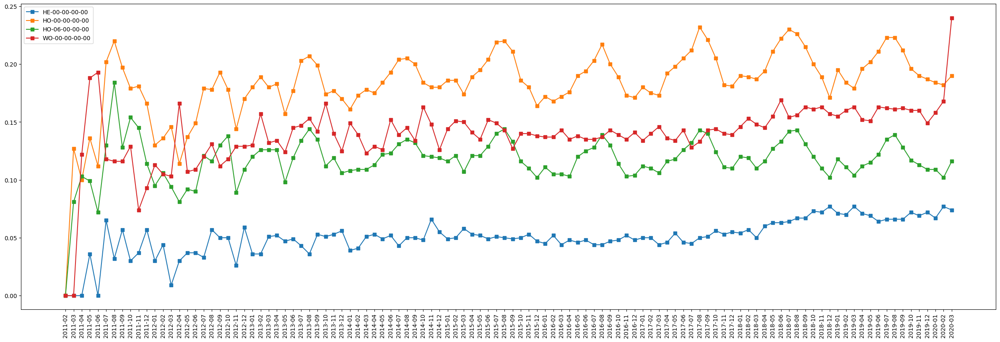

# Introduction
* This program classifies legal issues into a binary value for each National Subject Matter Index (NSMI). (https://nsmi.lsntap.org/browse-v2) 
"Category" means 20 indexes. 
"Class" means sub categories under the category.
### Data
* Train Data: 2777 labeled articles from https://spot.suffolklitlab.org/data/2019-12-06_95p-confidence_binary.csv
* Test Data: 900,000 submissions from reddit.com/r/legaladvice using subreddit downloader(https://github.com/heeh/subreddit_downloader/blob/master/stream_downloader.py)

### Preprocessing
* Each article has a binary value(0 or 1) that indicates if this article is related to a specific legal class. 
* We ignore unlabeled entries when constructing a model.
* Among 100+ classes from NSMI-v2, we extracted 36 classes which has more than 10 positive submissions.
* After getting the classifier, we chose 16 classes that has reasonable recall.

### Classifier
* First, the program converts each text into an tf-idf vector.
* After getting the vectors, we apply sklearn LogisticRegression model with L1 loss.
* We predict the model with 10-fold cross-validation.

### Test
* We apply the classifier to the 900,000 submissions on reddit data.
* The classifier produces hard and soft labels.
* We get the final prevalence using freq-e (https://github.com/slanglab/freq-e)
